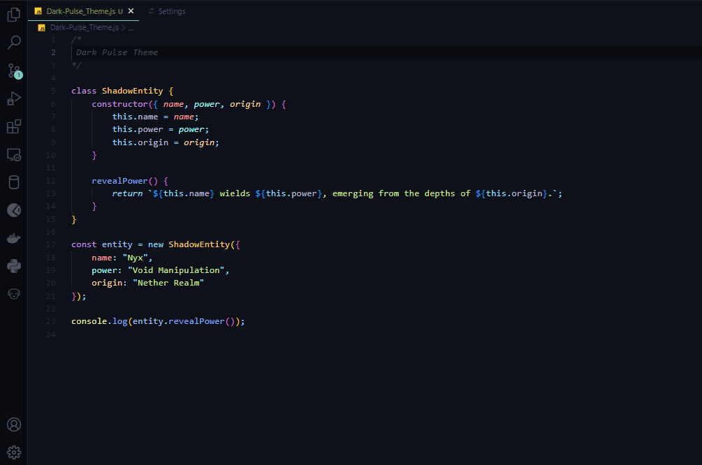

# Dark Pulse Theme - A Sleek VS Code Theme [](https://github.com/ZUN4lR/Dark-Pulse-Theme.git)

> A modern and stylish theme designed to enhance your Visual Studio Code experience.

---
<div style="border-radius: 10%; overflow: hidden; width: 100%;">
    
</div>

## 🚀 Installation Guide

### 📥 Step 1: Clone the Repository
First, download the theme from GitHub:

```bash
git clone https://github.com/ZUN4lR/Dark-Pulse-Theme.git
cd Dark-Pulse-Theme
npm install
```

### 🔧 Step 2: Install Required Package
To generate a `.vsix` file for manual installation, install `vsce` (VS Code Extension Manager):

```bash
npm install -g @vscode/vsce
```

### 📦 Step 3: Generate the `.vsix` File
Run the following command inside the theme directory:

```bash
vsce package
```

This will create a `.vsix` file in your theme folder.

### 🛠 Step 4: Install the Theme in VS Code
1. Open **Visual Studio Code**.  
2. Go to **Extensions**  
    `Ctrl+Shift+X` /  
    `Ctrl+Shift+X` /  
    `⌘+Shift+X`.  
3. Click on the `...` (More Actions) button in the top-right corner.  
4. Select **Install from VSIX...**  
5. Choose the generated `.vsix` file and install it.

---

## ⚡ Activating Your Theme 

1. Open **Command Palette** (`Ctrl+Shift+P` / `⌘+Shift+P` on macOS).
2. Search for `Preferences: Color Theme` and select it.
3. Choose **Dark Pulse ** from the list.

> ✨ *Enjoy the modern, sleek look of Dark Pulse Theme in your coding environment!*

---

## 🎨 Customizing the Theme
Want to personalize it further? Override theme colors by adding the following in `settings.json`:

```json
{
    "workbench.colorCustomizations": {
        "editor.background": "#1E1E1E",
        "editor.foreground": "#D4D4D4"
    }
}
```

---

## 💡 Recommended VS Code Settings
For the best experience, consider adding these settings:

```json
{
    "editor.lineHeight": 28,
    "editor.fontLigatures": true,
    "workbench.iconTheme": "material-icon-theme"
}
```

---

## 📜 License
Dark Pulse Theme is licensed under the **MIT License**.

---

<p align="center">  <br /> &copy; 2025 ZUN4iR </p>
